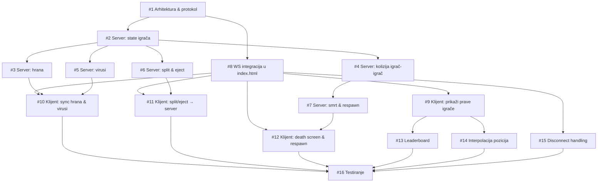

# Issues — Multiplayer Agar.io

---

## FAZA 0 — Arhitektura

---

### #1 — Definisati multiplayer arhitekturu i WebSocket protokol

**Opis:**
Pre ikakve implementacije, tim mora dogovoriti ko ima autoritet nad igrom. Preporučena opcija je **server-autoritativan model** — server odlučuje o svim kolizijama, masi i smrti. Klijent samo šalje inpute (kretanje, split, eject) i renderuje state koji server vrati.

Treba dokumentovati sve poruke u oba smera:

| Smer | Tip | Polja |
|---|---|---|
| klijent → server | `join` | `ime` |
| klijent → server | `move` | `x, y` (world koordinate) |
| klijent → server | `split` | — |
| klijent → server | `eject` | — |
| klijent → server | `respawn` | — |
| server → klijent | `welcome` | `id` (dodeljuje server) |
| server → klijent | `game_state` | `igraci[], hrana[], virusi[]` |
| server → klijent | `dead` | `killer_name` |

**Šta je problem sad:** Server trenutno dodeljuje `id = str(id(websocket))` i klijent mora da pogađa koji je njegov ID gledanjem poslednjeg u listi. Ovo treba zameniti eksplicitnom `welcome` porukom.

---

## FAZA 1 — Server

---

### #2 — Server: proširiti state igrača (masa, ćelije, boja)

**Opis:**
`server.py` trenutno čuva samo `{id, x, y, ime}` po igraču. To nije dovoljno za multiplayer. Treba čuvati:

```python
{
  "id": "...",
  "ime": "...",
  "hue": 220,          # boja (0-360), dodeljuje server pri join
  "alive": True,
  "cells": [
    { "x": 400, "y": 300, "mass": 50, "r": 12.6 }
  ]
}
```

Svaki igrač počinje sa jednom ćelijom mase 50 na nasumičnoj poziciji. Server šalje ovaj format u svakom `game_state` broadcastu.

**Zavisi od:** #1

---

### #3 — Server: generisanje i upravljanje hranom

**Opis:**
Hrana mora biti konzistentna za sve klijente — ne sme svaki klijent imati svoju hranu. Server generiše ~600 food pellet-a pri startu i čuva ih u listi. Svaki pellet ima `{id, x, y, mass, hue}`.

Kad server detektuje da je igrač pojeo pellet (u kolizijskoj proveri), uklanja ga iz liste i spawna novi na nasumičnoj poziciji. Hrana se šalje klijentima u svakom `game_state`.

**Napomena o optimizaciji:** 600 pellet-a u svakom frame-u je puno podataka. Moguća optimizacija: slati samo delta (šta je dodano/uklonjeno), ali za MVP je OK slati sve.

**Zavisi od:** #1, #2

---

### #4 — Server: detekcija kolizija između igrača

**Opis:**
Ovo je srž multiplayera. Server u svakom tick-u (20fps) proverava za svaki par ćelija:

```
ako mass_pred > mass_prey * 1.15
   i dist(pred, prey) < r_pred - r_prey * 0.3
→ pred pojeda prey
```

Igrač koji izgubi sve ćelije proglašava se mrtvim. Server šalje `dead` poruku tom igraču i uklanja ga iz `game_state` broadcastova.

**Zašto server, ne klijent:** Ako klijent odlučuje, dva igrača bi mogla istovremeno tvrditi da su jedan drugog pojeli, što bi dovelo do konflikta.

**Zavisi od:** #2

---

### #5 — Server: virusi

**Opis:**
Server generiše ~18 virusa pri startu (`{x, y, mass: 100, r, fed: 0}`) i šalje ih u `game_state`. Server proverava koliziju igrač-virus: ako ćelija igrača ima masu > 133 i udari u virus, server je dijeli na više manjih ćelija (pop efekat).

Opciono (za bonus): ako igrač ejectuje masu prema virusu 7 puta, virus se deli i šalje novi virus u nasumičnom smeru.

**Zavisi od:** #1, #2

---

### #6 — Server: split i eject logika

**Opis:**
Na `split` poruku: server deli svaku ćeliju igrača koja ima masu ≥ 72 na dve po pola, do maksimuma od 16 ćelija. Nova ćelija dobija brzinu u smeru koji je klijent bio usmeren. Server postavlja `mergeTimer` — ćelije ne mogu da se spoje X sekundi.

Na `eject` poruku: server oduzima 18 mase od ćelije (ako ima dovoljno) i kreira novi food pellet s brzinom u smeru miša. Taj pellet može pojesti virus (logika iz #5).

**Zavisi od:** #2, #3

---

### #7 — Server: smrt i respawn

**Opis:**
Kad igrač izgubi sve ćelije (detektovano u #4), server:
1. Postavlja `alive = False`
2. Šalje mu `{type: "dead", killer_name: "..."}` poruku
3. Isključuje ga iz `game_state` broadcastova

Na `respawn` poruku od klijenta, server:
1. Bira slobodnu nasumičnu poziciju (dalje od svih trenutnih igrača)
2. Kreira novu ćeliju mase 50
3. Počinje ponovo da ga uključuje u broadcast

**Zavisi od:** #4

---

## FAZA 2 — Klijent

---

### #8 — Kreirati novi `index.html` kao multiplayer klijent

**Opis:**
`index.html` više ne postoji — preimenovan je u `singleplayer.html`. Novi `index.html` treba kreirati kao multiplayer klijent, koristeći `singleplayer.html` kao polazišnu osnovu za render i klase, a `clienttest.html` kao referencu za WebSocket konekciju.

Novi fajl treba da ima:

- WS konekciju na `ws://localhost:8765`
- Na `onopen`: poslati `{type: "join", ime: playerName}`
- Čuvati `myId` iz `welcome` poruke
- U game loopu (60fps): slati `{type: "move", x: wMouseX, y: wMouseY}` gde su koordinate u **world space** (ne screen space — konverzija već postoji u `singleplayer.html`)
- Na `onclose`/`onerror`: prikazati overlay

**Važno:** Slanje move poruke na 60fps može biti previše. Može se ograničiti na 20fps (sinhronizovati sa server tickom) ili slati samo kad se pozicija miša promeni.

**Zavisi od:** #1

---

### #9 — Klijent: renderovati prave igrače iz `game_state`

**Opis:**
Novi `index.html` ne sme da renderuje lokalne `Bot` objekte. Treba:

1. Primati `game_state.igraci[]` iz WS poruka
2. Za svakog igrača renderovati sve `cells[]` sa bojom `hue` i imenom
3. Sopstvene ćelije (`id === myId`) renderovati sa blagom transparentnošću (0.95 alpha) i pratiti kamerom
4. Tuđe ćelije renderovati normalno

Klasa `Bot` i lokalni botovi se ne preuzimaju iz `singleplayer.html` — server je autoritativan i botove ne šalje u ovoj fazi.

**Zavisi od:** #8, #2

---

### #10 — Klijent: sinhronizovati hranu i viruse sa serverom

**Opis:**
Novi `index.html` ne sme lokalno da generiše hranu ni viruse. `food[]` i `viruses[]` se pune isključivo iz svake `game_state` poruke.

Rendering funkcije `drawFood()` i `drawVirus()` preuzimaju se iz `singleplayer.html` — menja se samo izvor podataka.

Lokalna detekcija kolizije hrana-igrač se izostavlja; server je autoritativan i ažuriraće masu igrača u sledećem `game_state`.

**Zavisi od:** #8, #3, #5

---

### #11 — Klijent: proslijediti split i eject serveru

**Opis:**
U `singleplayer.html` `Space` i `W` pozivaju lokalne `player.split()` i `player.eject()`. U multiplayeru ove metode treba da:

1. Pošalju poruku serveru (`{type: "split"}` / `{type: "eject"}`)
2. **Ne menjaju lokalni state odmah** — čekaju `game_state` od servera

Ovo sprečava cheating i osigurava konzistentnost. Kratko kašnjenje (1-2 frame-a) je prihvatljivo.

**Zavisi od:** #8, #6

---

### #12 — Klijent: death screen i respawn u multiplayeru

**Opis:**
Na `{type: "dead", killer_name}` poruku od servera:
1. Prikazati `#dead-overlay` sa imenom ubice (npr. *"Pojeo te: Rex"*)
2. Zaustaviti lokalni game loop (ili nastaviti renderovati tuđe igrače u pozadini)

Na klik "Play Again":
1. Poslati `{type: "respawn"}` serveru
2. Sakriti overlay i nastaviti game loop

**Zavisi od:** #8, #7

---

### #13 — Klijent: leaderboard sa pravim igračima

**Opis:**
`updateUI()` preuzeta iz `singleplayer.html` gradi leaderboard od lokalnih `bots[]`. Treba je izmeniti da gradi leaderboard od `game_state.igraci[]` — zbrojiti masu svih ćelija svakog igrača, sortirati opadajuće, prikazati top 8. Sopstveni igrač (`id === myId`) obeležiti zelenom bojom.

**Zavisi od:** #9

---

## FAZA 3 — Polishing

---

### #14 — Interpolacija pozicija ostalih igrača

**Opis:**
Server šalje state na 20fps (50ms interval). Bez interpolacije, tuđi igrači se teleportuju umjesto da se kreću glatko. Rešenje: čuvati prethodni i trenutni primljeni state, a u render loopu (60fps) prikazivati interpoliranu poziciju između ta dva stanja koristeći faktor `t = (timeSinceLastUpdate / 50ms)`.

**Zavisi od:** #9

---

### #15 — Disconnect i error handling na klijentu

**Opis:**
Ako WS veza padne tokom igre, igrač treba da vidi jasnu poruku, a ne zamrznutu igru. Treba dodati overlay "Veza prekinuta — pokušaj ponovo" sa dugmetom koji reload-uje stranicu ili pokušava reconnect. Server već ispravno briše igrača u `finally` bloku.

**Zavisi od:** #8

---

### #16 — Integraciono testiranje sa više igrača

**Opis:**
Otvoriti igru u 2+ browsera (ili browser + incognito) i proveriti:
- Oba igrača vide jedni-druge u realnom vremenu
- Jedenje jedni-drugima radi ispravno
- Hrana je sinhronizovana (isti pellet ne može pojesti dva igrača)
- Split i eject se reflektuju kod svih klijenata
- Death screen se prikazuje igraču koji je pojeden
- Leaderboard prikazuje tačne podatke
- Disconnect jednog igrača ne ruši server ni drugog igrača

**Zavisi od:** svih prethodnih

---

## Graf zavisnosti



**Kritični put:** `#1 → #2 → #4 → #7 → #12` i `#1 → #8 → #9 → #13/#14`

**Paralelizacija:** Nakon što je `#1` gotov — server tim može raditi `#2, #3, #4, #5, #6` paralelno (nezavisni task-ovi), a klijent tim počinje `#8`.
